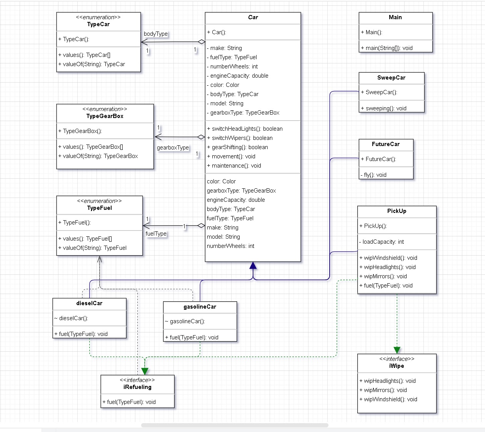

Спроектировать абстрактный класс «Car» у которого должны быть свойства: марка, модель, цвет, тип кузова, число колёс,
тип топлива, тип коробки передач, объём двигателя; методы: движение, обслуживание, переключение передач, включение фар,
включение дворников.
Создать конкретный автомобиль путём наследования класса «Car».
Расширить абстрактный класс «Car», добавить метод: подметать улицу. Создать конкретный автомобиль путём наследования 
класса «Car». Провести проверку принципа SRP.
Расширить абстрактный класс «Car», добавить метод: включение противотуманных фар, перевозка груза. 
Провести проверку принципа OCP.
Создать конкретный автомобиль путём наследования класса «Car», определить число колёс = 3. Провести проверку принципа LSP.

Создать конкретный автомобиль путём наследования класса «Car», определить метод «движение» - «полёт». Провести проверку принципа LSP.
Создать интерфейс «Заправочная станция», создать метод: заправка топливом.
Имплементировать метод интерфейса «Заправочная станция» в конкретный класс «Car».
Добавить в интерфейс «Заправочная станция» методы: протирка лобового стекла, протирка фар, протирка зеркал.
Имплементировать все методы интерфейса «Заправочная станция» в конкретный класс «Car». Провести проверку принципа ISP.
Создать дополнительный/е интерфейсы и имплементировать их в конкретный класс «Car». Провести проверку принципа ISP.
Создать путём наследования класса «Car» два автомобиля: с бензиновым и дизельным двигателями, имплементировать метод 
«Заправка топливом» интерфейса «Заправочная станция». Реализовать заправку каждого автомобиля подходящим топливом.
Провести проверку принципа DIP.
Задание 1. (Доделать 11 пункт)
11. Создать путём наследования класса «Car» два автомобиля: с бензиновым и дизельным двигателями,
    имплементировать метод «Заправка топливом» интерфейса «Заправочная станция». Реализовать заправку
    каждого автомобиля подходящим топливом. Провести проверку принципа DIP.
Задание 2. Сдать код с семинара и сделать UML-диаграмму по коду. UML-диаграмму можно сделать в любом редакторе. 
Диаграмма сдается файлом формата jpg.
Задание 3. (Задание со звездочкой) Конвертировать 3 паттерна с UML-диаграмм в код. Схемы паттернов приложены к уроку.
Задание сдается ссылкой на репозиторий с ответами на GitHub

-----------------------------------------------------------------------

Ответы:
Задание 1. Благодаря использованию интерфейса "Заправочной станции" принцип DIP не нарушен: исходный класс Car не 
надо модифицировать, как и остальные классы. Конкретная реализация (бензинового и дизельного автомобиля) была 
расширена и уточнена. Возможно, нарушен принцип LSP, но в данном случае это необходимая плата за конкретизацию 
параметров объектов. Как я это понимаю).
    Не очень понял, нужно-ли писать клиентский код в 11 пункте, однако судя по выполнению на семинаре это необязательно.

Задание 2. 
Задание 3. Успел реализовать только паттерн Фасад в модуле Fasade.